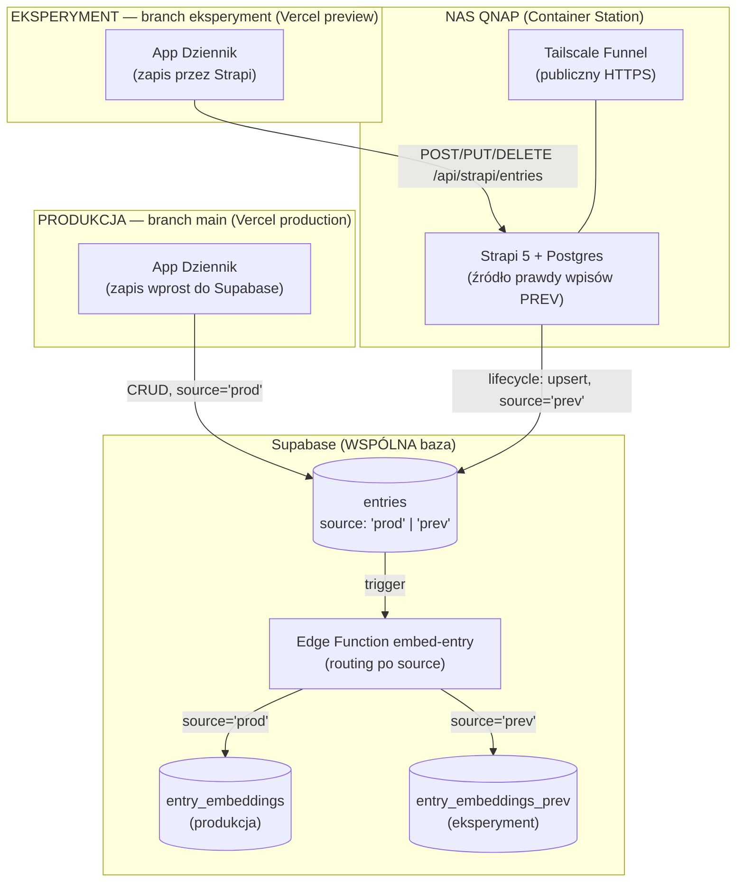
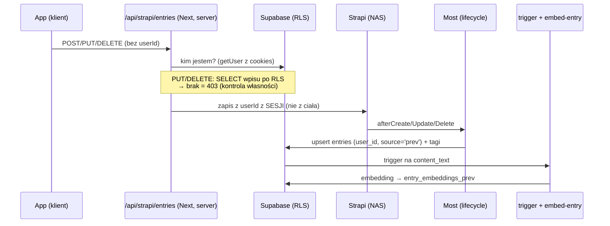

# Architektura — eksperyment (branch `eksperyment`)

Ten dokument opisuje **gałąź eksperymentalną** Dziennika. Bazowa architektura produkcyjna jest w [`architektura.md`](architektura.md) — tutaj opisujemy **tylko to, czym eksperyment się od niej różni**.

Dokument nie zawiera sekretów — wymienia jedynie **nazwy** zmiennych środowiskowych oraz opisowe (nie konkretne) adresy infrastruktury.

---

## TL;DR

Eksperyment dokłada trzy rzeczy do produkcyjnego Dziennika:

1. **Wielu użytkowników** — realna izolacja per konto (nie „jednoużytkownikowy w intencji"), z egzekwowaniem własności wpisów po stronie serwera.
2. **Strapi jako źródło prawdy wpisów** — wpisy powstają w headless CMS **Strapi na NAS-ie (QNAP)**, a stamtąd są mostowane do Supabase (wektoryzacja i wyszukiwanie bez zmian).
3. **Izolacja danych eksperymentu od produkcji** — ta sama baza Supabase, ale wpisy eksperymentu są oznaczane `source='prev'`, a ich embeddingi trafiają do osobnej tabeli.

> ⚠️ **Produkcja (`main`) jest nietykalna.** Gałąź `eksperyment` **nie jest** i **nie może być** mergowana do `main` bez świadomej decyzji. Produkcja działa jak dotąd (zapis prosto do Supabase, logowanie na współdzielone konto gościa). Ewentualne przeniesienie funkcji z eksperymentu na produkcję to osobny temat (migracje).

---

## Topologia wdrożenia

Jedna baza Supabase i jeden Strapi/NAS obsługują **dwa środowiska**, rozdzielone kolumną `source` i przez RLS:



| | Produkcja (`main`) | Eksperyment (`eksperyment`) |
|---|---|---|
| Wdrożenie Vercel | production | preview |
| Ścieżka zapisu wpisu | app → Supabase (bezpośrednio) | app → Strapi (NAS) → most → Supabase |
| Logowanie „gość" | wspólne konto e-mail (współdzielone dane) | wspólne konto **osobne** (`gosc-eksperyment@`) — współdzielone dane i zakupy |
| Model użytkowników | jednoużytkownikowy w intencji | wielu użytkowników, gating własności |
| `entries.source` | `'prod'` (domyślnie) | `'prev'` (ustawia most) |
| Tabela embeddingów | `entry_embeddings` | `entry_embeddings_prev` |
| RPC wyszukiwania | `search_entries_hybrid` | `search_entries_hybrid_prev` |
| Płatności Stripe | live (produkcyjne) | **tryb testowy** (`sk_test` + `STRIPE_PRICE_MAP`) |
| Analityka PostHog | brak | włączona (nagrania, heatmapy, Web Analytics) |

---

## Strapi jako źródło prawdy (NAS)

Wpisy eksperymentu powstają w **Strapi 5** (TypeScript) uruchomionym w **Container Station** na NAS-ie QNAP (Docker Compose: `strapi`, `strapiDB` = Postgres 16, `tailscale`). Publiczny dostęp HTTPS zapewnia **Tailscale Funnel** (kontener userspace) — bez otwierania portów na routerze i bez przenoszenia domen.

- **Content-type `entry`** (pola: `entryId` = współdzielony UUID z Supabase, `userId`, `contentHtml`, `contentText`, `mood`, `tags` (json), `media` (json), `entryCreatedAt`; `draftAndPublish: false`).
- **Most Strapi → Supabase** (lifecycle hook `afterCreate/afterUpdate/afterDelete`):
  - upsert do `entries` z `service_role`, stemplując `user_id` **wartością z wpisu** (`result.userId`), a nie stałą — to podstawa multi-user;
  - `entries.source = 'prev'` — znacznik kierujący wektoryzację do osobnej tabeli;
  - sync tagów do `tags`/`entry_tags` (per `userId`);
  - `afterDelete` kasuje wiersz w Supabase (kaskada `entry_tags`, `media`, embeddingi).
- Zapis `content_text` wyzwala istniejący trigger `embed_entry_on_write` → Edge Function `embed-entry` (patrz [Izolacja embeddingów](#izolacja-embeddingów-prev)).

> Kod Strapi żyje w osobnym projekcie (poza tym repo). Sekrety (token API, klucze Supabase, `TS_AUTHKEY`) trzymane w gitignorowanym `.env` na NAS-ie (chmod 600).

---

## Ścieżka zapisu wpisu (eksperyment)



Kluczowe pliki (w tym repo, na branchu `eksperyment`):

- [`src/lib/db-supabase.ts`](src/lib/db-supabase.ts) — `createEntry`/`updateEntry`/`deleteEntry` piszą do Strapi przez server-route (klient generuje `entryId`; media dalej do Supabase Storage; odczyty bez zmian).
- [`src/app/api/strapi/entries/route.ts`](src/app/api/strapi/entries/route.ts) — auth + **gating własności**; `userId` brany z sesji Supabase, nigdy z ciała żądania.
- [`src/lib/strapi-server.ts`](src/lib/strapi-server.ts) — server-only klient Strapi (token ukryty na serwerze).

---

## Multi-user

Baza była już RLS-owana per `user_id`; eksperyment domyka to na warstwie zapisu i logowania.

- **Stemplowanie właściciela:** route czyta zalogowanego użytkownika z cookies (`createSupabaseRouteHandlerClient`) i przekazuje `userId` do Strapi. Klient **nie może** podać cudzego `userId`.
- **Gating własności (serwerowo):** `PUT`/`DELETE` sprawdzają, czy wpis jest widoczny dla użytkownika przez RLS (SELECT po `id`) — brak → **403**. Blokuje edycję, kasowanie i „przejęcie" cudzego wpisu po zgadniętym `entryId`.
- **Kolizja `entryId`:** unikalny `entryId` w Strapi zapobiega nadpisaniu cudzego wpisu przy tworzeniu.
- **Gość = wspólne konto (osobne od produkcji):** [`src/app/login/page.tsx`](src/app/login/page.tsx) — przycisk „Wejdź jako gość" loguje na jedno wspólne konto eksperymentu (`gosc-eksperyment@dziennik.local`, zakładane raz przy 1. wejściu), **osobne** od produkcyjnego `gosc@`, by nie mieszać danych prod/prev. E-mail/hasło i Google działają jak dotąd. **Świadoma zmiana** (2026-07-09): wcześniej `signInAnonymously()` dawał izolację per tester, ale zakupy gościa (entitlements per `user_id`) ginęły po wylogowaniu — wspólne konto daje trwałe, współdzielone zakupy kosztem izolacji wpisów między testerami.

---

## Izolacja embeddingów PREV

Cel: wektory eksperymentu **nie mieszają się** z produkcyjnymi, mimo wspólnej bazy. Realizacja w migracji [`supabase/migrations/0006_prev_embeddings.sql`](supabase/migrations/0006_prev_embeddings.sql):

- kolumna `entries.source` (`text`, default `'prod'`; most ustawia `'prev'`) — addytywna, nie zmienia zachowania produkcji;
- tabela `entry_embeddings_prev` (kształt jak `entry_embeddings`, RLS „czytam swoje", indeksy HNSW);
- RPC `search_entries_hybrid_prev` (bliźniak `search_entries_hybrid` czytający tabelę PREV).

Routing dzieje się w Edge Function [`supabase/functions/embed-entry/index.ts`](supabase/functions/embed-entry/index.ts):

```ts
const table = rec.source === "prev" ? "entry_embeddings_prev" : "entry_embeddings";
```

App eksperymentu przeszukuje tabelę PREV — [`src/lib/api/hybrid-search.ts`](src/lib/api/hybrid-search.ts) woła `search_entries_hybrid_prev`. Produkcja (`source='prod'`) i jej RPC pozostają bez zmian.

> **Świadoma decyzja:** wpisy PREV fizycznie leżą w tej samej tabeli `entries` (oddzielone przez `user_id`/RLS), ale **wektory mają osobną tabelę**. Pełna separacja bazodanowa (osobny projekt Supabase) była rozważana, ale odrzucona na rzecz lżejszego wariantu „ta sama baza, osobna tabela embeddingów".

---

## Płatności w trybie testowym (Stripe)

Eksperyment testuje pełną ścieżkę zakupu person **bez ruszania produkcyjnego (live) billingu**. Ta sama baza `entitlements`, ale osobne środowisko Stripe i osobne ceny.

- **Klucz testowy:** [`src/lib/stripe.ts`](src/lib/stripe.ts) czyta `STRIPE_SECRET_KEY`; na preview eksperymentu jest to `sk_test_…` (produkcja: `sk_live_…`). Klient Stripe jest **server-only** — nigdy do przeglądarki.
- **Override cen:** [`getStripePriceMap()`](src/lib/woocommerce.ts) najpierw sprawdza env `STRIPE_PRICE_MAP` (JSON `{sku: priceId}`) i — jeśli jest — używa **testowych** `price_…` zamiast czytać `stripe_price_id` z WooCommerce. Dzięki temu preview korzysta z testowych Product/Price, a katalog WC (produkcyjny) zostaje nietknięty. Zły JSON → cichy fallback do WooCommerce (checkout się nie wywala).
- **Checkout:** [`/api/checkout`](src/app/api/checkout/route.ts) tworzy `mode: subscription`; `client_reference_id`/metadata niosą `user_id` + `sku`. Gość ma email `""` → `|| undefined`, żeby Stripe sam zebrał adres (fix `51058e7`).
- **Webhook:** `/api/stripe/webhook` (`STRIPE_WEBHOOK_SECRET`) po opłaceniu upsertuje do `entitlements`. Testowe zakupy trafiają do tej samej tabeli co produkcyjne — rozróżniane po tym, że powstały pod kontem `gosc-eksperyment@` / testowych userach.

> **Świadoma decyzja:** produkcyjny live Stripe pozostaje nietknięty; eksperyment żyje w sandboxie testowym Stripe. WooCommerce nadal jest tylko katalogiem i edytorem promptów, nie billingiem.

---

## Analityka (PostHog) — tylko eksperyment

PostHog jest wpięty **wyłącznie na gałęzi `eksperyment`** (produkcja `main` go nie ładuje). Inicjalizacja jest no-op bez `NEXT_PUBLIC_POSTHOG_KEY`, więc lokalnie i na produkcji po prostu się nie uruchamia. Zakres: autocapture, ręczne pageviews (App Router), nagrania sesji, heatmapy, Web Analytics + Web Vitals, error tracking.

- **Provider:** [`src/components/analytics/PostHogProvider.tsx`](src/components/analytics/PostHogProvider.tsx) — init, ręczny `$pageview` przy każdej nawigacji, `Identify` wiążący zdarzenia z użytkownikiem Supabase po `user.id` (nie e-mailu). Każde zdarzenie dostaje `app_env: "eksperyment"` → dane eksperymentu łatwo odfiltrować w dashboardach.
- **Reverse proxy przez `/ingest`:** rewrites w [`next.config.ts`](next.config.ts) przepuszczają ruch analityki przez własną domenę (region EU: `eu.i.posthog.com` + `eu-assets.i.posthog.com`) zamiast `*.i.posthog.com` — dzięki temu adblockery/uBlock nie ucinają zdarzeń, pageview'ów ani session replay. Klient wskazuje `api_host: "/ingest"`.
- **Prywatność (świadomy wybór):** nagrania maskują pola formularzy (`maskAllInputs`), ale **NIE** maskują wyświetlanej treści wpisów. To dziennik — by ukryć też treść wpisów, ustaw `maskAllText: true` w `session_recording`.

---

## Odporność agenta (retrieval opcjonalny)

Czat z Agentem korzysta z hybrydowego retrievalu po tabeli PREV, ale **nie zależy** od niego krytycznie. W [`/api/chat`](src/app/api/chat/route.ts) wywołanie `hybridSearchEntries` jest w `try/catch` — gdy padnie (np. brak `SUPABASE_SECRET_KEY`, błąd RPC), czat kontynuuje **bez** kontekstu z wyszukiwania zamiast się wywalić (fix `17000c9`). Serwerowy retrieval wymaga `SUPABASE_SECRET_KEY` (odczyt przez `service_role`).

---

## Zmienne środowiskowe (dodatkowe wobec produkcji)

Tylko **nazwy** — bez wartości. Sekrety trzymane w `.env.local` (app) i `.env` na NAS-ie (most).

| Zmienna | Gdzie | Do czego |
|---|---|---|
| `STRAPI_URL` | app (server) | endpoint Strapi (publiczny HTTPS przez Tailscale Funnel) |
| `STRAPI_API_TOKEN` | app (server) | token zapisu do Strapi (nigdy do przeglądarki) |
| `SUPABASE_URL` | NAS / most | most → Supabase |
| `SUPABASE_SECRET_KEY` | NAS / most **+ app (server)** | `service_role`: most (omija RLS) oraz serwerowy retrieval agenta w `/api/chat` |
| `SUPABASE_USER_ID` | NAS / most | fallback właściciela dla starych/ręcznych rekordów (multi-user bierze `userId` z wpisu) |
| `TS_AUTHKEY` | NAS | rejestracja węzła Tailscale (Funnel) |
| `NEXT_PUBLIC_POSTHOG_KEY` | app (klient) | klucz projektu PostHog; brak → analityka wyłączona (no-op) |
| `STRIPE_SECRET_KEY` | app (server) | Stripe; na eksperymencie `sk_test_…` (produkcja: `sk_live_…`) |
| `STRIPE_PRICE_MAP` | app (server) | JSON `{sku: priceId}` — override testowych cen Stripe (omija `stripe_price_id` z WooCommerce) |
| `STRIPE_WEBHOOK_SECRET` | app (server) | weryfikacja podpisu webhooka `/api/stripe/webhook` |

---

## Uwagi operacyjne / bezpieczeństwo

- **Sekret webhooka embeddingów.** Redeploy Edge Function `embed-entry` przez Management API/MCP potrafi zgubić env `EMBED_WEBHOOK_SECRET` → funkcja odrzuca poprawny sekret triggera (403) → wektoryzacja pada (produkcja i PREV). Dlatego sekret jest wpisany **wprost** w kodzie wdrożonej funkcji (jak w [`migracji 0004`](supabase/migrations/0004_embed_webhook_secret.sql) dla triggera); w repo pozostaje placeholder `__EMBED_SECRET__` — przy każdym deployu podstawić realną wartość (tę samą co w DB-triggerze `tg_embed_entry`).
- **Reliability:** po włączeniu ścieżki Strapi zapis wpisu w eksperymencie zależy od dostępności NAS-a (prąd/internet w domu). Produkcja tej zależności nie ma.
- **Wektoryzacja jest asynchroniczna** (pg_net „fire-and-forget") — embedding pojawia się kilka sekund po zapisie.

---

## Co jeszcze NIE zrobione (TODO eksperymentu)

- **Publiczny preview:** wyłączenie Vercel Deployment Protection („Require Log In") — krok w panelu Vercel, wymaga użytkownika.
- **Prawdziwa wieloużytkowość mostu:** most jest per-user na zapisie, ale gdy testerzy anonimowi tworzą wpisy przez Strapi, powstają w nim rekordy „śmieciowe" — do sprzątania.
- **Wyszukiwanie/agent na tabeli PREV:** wpięte (`search_entries_hybrid_prev`), ale nie przetestowane pod obciążeniem.
- Ewentualna **pełna separacja** (osobny projekt Supabase dla PREV), jeśli lekki wariant okaże się niewystarczający.
