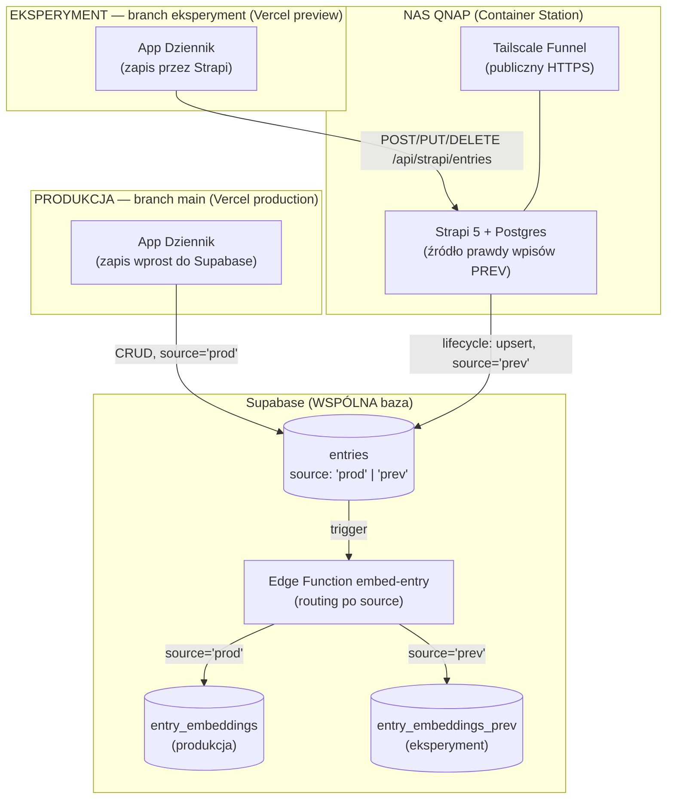
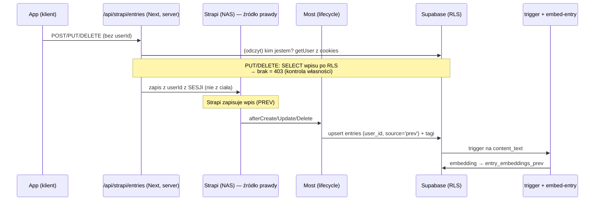

# Architektura — eksperyment (branch `eksperyment`)

Ten dokument opisuje **gałąź eksperymentalną** Dziennika. Najpierw wypunktowane są **różnice wobec produkcji** (`main`), a na końcu — w sekcji [Reszta architektury (niezmieniona)](#reszta-architektury-niezmieniona-wobec-produkcji) — rekapitulacja tego, co eksperyment dziedziczy z produkcji bez zmian, żeby dokument dawał **pełny obraz** bez skakania do [`architektura.md`](architektura.md).

Dokument nie zawiera sekretów — wymienia jedynie **nazwy** zmiennych środowiskowych oraz opisowe (nie konkretne) adresy infrastruktury.

---

## TL;DR

Eksperyment dokłada trzy rzeczy do produkcyjnego Dziennika:

1. **Egzekwowanie własności na zapisie** — produkcja **już** izoluje dane per konto przez RLS (odczyt). Eksperyment domyka to na *zapisie*: `user_id` stemplowany z sesji (nigdy z ciała żądania), a `PUT`/`DELETE` cudzego wpisu → **403**. To nie „wprowadzenie multi-user" (ten był), tylko twarde egzekwowanie własności, gdy wpisy realnych testerów przechodzą przez Strapi.
2. **Strapi jako źródło prawdy wpisów** — wpisy powstają w headless CMS **Strapi na NAS-ie (QNAP)**, a stamtąd są mostowane do Supabase (wektoryzacja i wyszukiwanie bez zmian).
3. **Izolacja danych eksperymentu od produkcji** — ta sama baza Supabase, ale wpisy eksperymentu są oznaczane `source='prev'`, a ich embeddingi trafiają do osobnej tabeli.

> ⚠️ **Produkcja (`main`) jest nietykalna.** Gałąź `eksperyment` **nie jest** i **nie może być** mergowana do `main` bez świadomej decyzji. Produkcja działa jak dotąd (zapis prosto do Supabase, logowanie na współdzielone konto gościa). Ewentualne przeniesienie funkcji z eksperymentu na produkcję to osobny temat (migracje).

---

## Topologia wdrożenia

Jedna baza Supabase i jeden Strapi/NAS obsługują **dwa środowiska**, rozdzielone kolumną `source` i przez RLS:



| | Produkcja (`main`) | Eksperyment (`eksperyment`) |
|---|---|---|
| Wdrożenie Vercel | production | preview |
| Ścieżka zapisu wpisu | app → Supabase (bezpośrednio) | app → Strapi (NAS) → most → Supabase |
| Logowanie „gość" | wspólne konto e-mail (współdzielone dane) | wspólne konto **osobne** (`gosc-eksperyment@`) — współdzielone dane i zakupy |
| Izolacja danych | RLS per `user_id` (odczyt) — było | RLS + **serwerowy gating zapisu** (403 na cudze) |
| `entries.source` | `'prod'` (domyślnie) | `'prev'` (ustawia most) |
| Tabela embeddingów | `entry_embeddings` | `entry_embeddings_prev` |
| RPC wyszukiwania | `search_entries_hybrid` | `search_entries_hybrid_prev` |
| Stripe | tryb testowy, ceny z WooCommerce | tryb testowy, ceny z `STRIPE_PRICE_MAP` |
| Analityka PostHog | brak | włączona (nagrania, heatmapy, Web Analytics) |

> Billing Stripe **na obu** środowiskach działa w trybie testowym — integracja nie jest jeszcze uruchomiona na żywo. Różnica eksperymentu to wyłącznie źródło cen (override `STRIPE_PRICE_MAP`), nie „test vs live".

---

## Strapi jako źródło prawdy (NAS)

Wpisy eksperymentu powstają w **Strapi 5** (TypeScript) uruchomionym w **Container Station** na NAS-ie QNAP (Docker Compose: `strapi`, `strapiDB` = Postgres 16, `tailscale`). Publiczny dostęp HTTPS zapewnia **Tailscale Funnel** (kontener userspace) — bez otwierania portów na routerze i bez przenoszenia domen.

- **Content-type `entry`** (pola: `entryId` = współdzielony UUID z Supabase, `userId`, `contentHtml`, `contentText`, `mood`, `tags` (json), `media` (json), `entryCreatedAt`; `draftAndPublish: false`).
- **Most Strapi → Supabase** (lifecycle hook `afterCreate/afterUpdate/afterDelete`):
  - upsert do `entries` z `service_role`, stemplując `user_id` **wartością z wpisu** (`result.userId`), a nie stałą — to podstawa multi-user;
  - `entries.source = 'prev'` — znacznik kierujący wektoryzację do osobnej tabeli;
  - sync tagów do `tags`/`entry_tags` (per `userId`);
  - `afterDelete` kasuje wiersz w Supabase (kaskada `entry_tags`, `media`, embeddingi).
- Zapis `content_text` wyzwala istniejący trigger `embed_entry_on_write` → Edge Function `embed-entry` (patrz [Izolacja embeddingów](#izolacja-embeddingów-prev)).

> Kod Strapi żyje w osobnym projekcie (poza tym repo). Sekrety (token API, klucze Supabase, `TS_AUTHKEY`) trzymane w gitignorowanym `.env` na NAS-ie (chmod 600).

---

## Ścieżka zapisu wpisu (eksperyment)

Wpis najpierw ląduje w **Strapi** (źródło prawdy), a dopiero stamtąd most wgrywa go do Supabase. Wcześniejsze odbicie o Supabase to wyłącznie **odczyt tożsamości/własności** (kim jest zalogowany użytkownik) — nie zapis.



Kluczowe pliki (w tym repo, na branchu `eksperyment`):

- [`src/lib/db-supabase.ts`](src/lib/db-supabase.ts) — `createEntry`/`updateEntry`/`deleteEntry` piszą do Strapi przez server-route (klient generuje `entryId`; media dalej do Supabase Storage; odczyty bez zmian).
- [`src/app/api/strapi/entries/route.ts`](src/app/api/strapi/entries/route.ts) — auth + **gating własności**; `userId` brany z sesji Supabase, nigdy z ciała żądania.
- [`src/lib/strapi-server.ts`](src/lib/strapi-server.ts) — server-only klient Strapi (token ukryty na serwerze).

---

## Multi-user

Baza była już RLS-owana per `user_id`; eksperyment domyka to na warstwie zapisu i logowania.

- **Stemplowanie właściciela:** route czyta zalogowanego użytkownika z cookies (`createSupabaseRouteHandlerClient`) i przekazuje `userId` do Strapi. Klient **nie może** podać cudzego `userId`.
- **Gating własności (serwerowo):** `PUT`/`DELETE` sprawdzają, czy wpis jest widoczny dla użytkownika przez RLS (SELECT po `id`) — brak → **403**. Blokuje edycję, kasowanie i „przejęcie" cudzego wpisu po zgadniętym `entryId`.
- **Kolizja `entryId`:** unikalny `entryId` w Strapi zapobiega nadpisaniu cudzego wpisu przy tworzeniu.
- **Gość = wspólne konto (osobne od produkcji):** [`src/app/login/page.tsx`](src/app/login/page.tsx) — przycisk „Wejdź jako gość" loguje na jedno wspólne konto eksperymentu (`gosc-eksperyment@dziennik.local`, zakładane raz przy 1. wejściu), **osobne** od produkcyjnego `gosc@`, by nie mieszać danych prod/prev. E-mail/hasło i Google działają jak dotąd. **Świadoma zmiana** (2026-07-09): wcześniej `signInAnonymously()` dawał izolację per tester, ale zakupy gościa (entitlements per `user_id`) ginęły po wylogowaniu — wspólne konto daje trwałe, współdzielone zakupy kosztem izolacji wpisów między testerami.

---

## Izolacja embeddingów PREV

Cel: wektory eksperymentu **nie mieszają się** z produkcyjnymi, mimo wspólnej bazy. Realizacja w migracji [`supabase/migrations/0006_prev_embeddings.sql`](supabase/migrations/0006_prev_embeddings.sql):

- kolumna `entries.source` (`text`, default `'prod'`; most ustawia `'prev'`) — addytywna, nie zmienia zachowania produkcji;
- tabela `entry_embeddings_prev` (kształt jak `entry_embeddings`, RLS „czytam swoje", indeksy HNSW);
- RPC `search_entries_hybrid_prev` (bliźniak `search_entries_hybrid` czytający tabelę PREV).

Routing dzieje się w Edge Function [`supabase/functions/embed-entry/index.ts`](supabase/functions/embed-entry/index.ts):

```ts
const table = rec.source === "prev" ? "entry_embeddings_prev" : "entry_embeddings";
```

App eksperymentu przeszukuje tabelę PREV — [`src/lib/api/hybrid-search.ts`](src/lib/api/hybrid-search.ts) woła `search_entries_hybrid_prev`. Produkcja (`source='prod'`) i jej RPC pozostają bez zmian.

> **Świadoma decyzja:** wpisy PREV fizycznie leżą w tej samej tabeli `entries` (oddzielone przez `user_id`/RLS), ale **wektory mają osobną tabelę**. Pełna separacja bazodanowa (osobny projekt Supabase) była rozważana, ale odrzucona na rzecz lżejszego wariantu „ta sama baza, osobna tabela embeddingów".

---

## Płatności — override cen (Stripe)

Billing person (Stripe, subskrypcja roczna; źródło prawdy o uprawnieniach to tabela `entitlements`) działa jak w produkcji. **Oba środowiska korzystają ze Stripe w trybie testowym** — integracja nie jest jeszcze uruchomiona na żywo. Jedyna różnica eksperymentu to **skąd brane są ceny**:

- **Override cen przez env:** [`getStripePriceMap()`](src/lib/woocommerce.ts) najpierw sprawdza `STRIPE_PRICE_MAP` (JSON `{sku: priceId}`); jeśli jest ustawiony, używa tych `price_…` zamiast czytać `stripe_price_id` z produktów WooCommerce. Eksperyment ma ten override ustawiony, produkcja czyta ceny z WC. Zły JSON → cichy fallback do WooCommerce (checkout się nie wywala).
- **Checkout:** [`/api/checkout`](src/app/api/checkout/route.ts) tworzy `mode: subscription`; `client_reference_id`/metadata niosą `user_id` + `sku`. Gość ma email `""` → `|| undefined`, żeby Stripe sam zebrał adres (fix `51058e7`).
- **Webhook:** `/api/stripe/webhook` (`STRIPE_WEBHOOK_SECRET`) po opłaceniu upsertuje do `entitlements` — tej samej tabeli co produkcja.

> WooCommerce pozostaje **katalogiem i edytorem promptów**, nie warstwą billingową — bez zmian wobec produkcji.

---

## Analityka (PostHog) — tylko eksperyment

PostHog jest wpięty **wyłącznie na gałęzi `eksperyment`** (produkcja `main` go nie ładuje). Inicjalizacja jest no-op bez `NEXT_PUBLIC_POSTHOG_KEY`, więc lokalnie i na produkcji po prostu się nie uruchamia. Zakres: autocapture, ręczne pageviews (App Router), nagrania sesji, heatmapy, Web Analytics + Web Vitals, error tracking.

- **Provider:** [`src/components/analytics/PostHogProvider.tsx`](src/components/analytics/PostHogProvider.tsx) — init, ręczny `$pageview` przy każdej nawigacji, `Identify` wiążący zdarzenia z użytkownikiem Supabase po `user.id` (nie e-mailu). Każde zdarzenie dostaje `app_env: "eksperyment"` → dane eksperymentu łatwo odfiltrować w dashboardach.
- **Reverse proxy przez `/ingest`:** rewrites w [`next.config.ts`](next.config.ts) przepuszczają ruch analityki przez własną domenę (region EU: `eu.i.posthog.com` + `eu-assets.i.posthog.com`) zamiast `*.i.posthog.com` — dzięki temu adblockery/uBlock nie ucinają zdarzeń, pageview'ów ani session replay. Klient wskazuje `api_host: "/ingest"`.
- **Prywatność (świadomy wybór):** nagrania maskują pola formularzy (`maskAllInputs`), ale **NIE** maskują wyświetlanej treści wpisów. To dziennik — by ukryć też treść wpisów, ustaw `maskAllText: true` w `session_recording`.

---

## Odporność agenta (retrieval opcjonalny)

Czat z Agentem korzysta z hybrydowego retrievalu po tabeli PREV, ale **nie zależy** od niego krytycznie. W [`/api/chat`](src/app/api/chat/route.ts) wywołanie `hybridSearchEntries` jest w `try/catch` — gdy padnie (np. brak `SUPABASE_SECRET_KEY`, błąd RPC), czat kontynuuje **bez** kontekstu z wyszukiwania zamiast się wywalić (fix `17000c9`). Serwerowy retrieval wymaga `SUPABASE_SECRET_KEY` (odczyt przez `service_role`).

---

## Zmienne środowiskowe (dodatkowe wobec produkcji)

Tylko **nazwy** — bez wartości. Sekrety trzymane w `.env.local` (app) i `.env` na NAS-ie (most).

| Zmienna | Gdzie | Do czego |
|---|---|---|
| `STRAPI_URL` | app (server) | endpoint Strapi (publiczny HTTPS przez Tailscale Funnel) |
| `STRAPI_API_TOKEN` | app (server) | token zapisu do Strapi (nigdy do przeglądarki) |
| `SUPABASE_URL` | NAS / most | most → Supabase |
| `SUPABASE_SECRET_KEY` | NAS / most **+ app (server)** | `service_role`: most (omija RLS) oraz serwerowy retrieval agenta w `/api/chat` |
| `SUPABASE_USER_ID` | NAS / most | fallback właściciela dla starych/ręcznych rekordów (multi-user bierze `userId` z wpisu) |
| `TS_AUTHKEY` | NAS | rejestracja węzła Tailscale (Funnel) |
| `NEXT_PUBLIC_POSTHOG_KEY` | app (klient) | klucz projektu PostHog; brak → analityka wyłączona (no-op) |
| `STRIPE_SECRET_KEY` | app (server) | Stripe (server-only); oba środowiska w trybie testowym (`sk_test_…`) |
| `STRIPE_PRICE_MAP` | app (server) | JSON `{sku: priceId}` — override cen Stripe na eksperymencie (omija `stripe_price_id` z WooCommerce) |
| `STRIPE_WEBHOOK_SECRET` | app (server) | weryfikacja podpisu webhooka `/api/stripe/webhook` |

---

## Uwagi operacyjne / bezpieczeństwo

- **Sekret webhooka embeddingów.** Redeploy Edge Function `embed-entry` przez Management API/MCP potrafi zgubić env `EMBED_WEBHOOK_SECRET` → funkcja odrzuca poprawny sekret triggera (403) → wektoryzacja pada (produkcja i PREV). Dlatego sekret jest wpisany **wprost** w kodzie wdrożonej funkcji (jak w [`migracji 0004`](supabase/migrations/0004_embed_webhook_secret.sql) dla triggera); w repo pozostaje placeholder `__EMBED_SECRET__` — przy każdym deployu podstawić realną wartość (tę samą co w DB-triggerze `tg_embed_entry`).
- **Reliability:** po włączeniu ścieżki Strapi zapis wpisu w eksperymencie zależy od dostępności NAS-a (prąd/internet w domu). Produkcja tej zależności nie ma.
- **Wektoryzacja jest asynchroniczna** (pg_net „fire-and-forget") — embedding pojawia się kilka sekund po zapisie.

---

## Reszta architektury (niezmieniona wobec produkcji)

Poniższe warstwy eksperyment **dziedziczy z produkcji bez zmian** — działają identycznie na obu gałęziach. Gdzie eksperyment coś modyfikuje, jest to zaznaczone odnośnikiem do sekcji „różnic" wyżej. Pełny opis każdej z nich: [`architektura.md`](architektura.md).

### Stack technologiczny

Next.js 16 (App Router) + React 19 + TypeScript 5; Tailwind CSS 4 + prymitywy UI w stylu shadcn (Radix); edytor **Tiptap 3**; **Supabase** (Postgres + RLS + Storage + Edge Functions); **Vercel AI SDK** (`ai` + `@ai-sdk/openai` + `@ai-sdk/react`); Stripe; WooCommerce (headless); MCP przez `mcp-handler`; Zod 4; `lucide-react` + `sonner`.

### Warstwa danych (Supabase)

Aktywna warstwa CRUD to [`src/lib/db-supabase.ts`](src/lib/db-supabase.ts) (`createEntry`/`updateEntry`/`deleteEntry`/`getEntry`/`listEntries` + tagi). Klient przeglądarkowy: [`src/lib/supabase/client.ts`](src/lib/supabase/client.ts) (`@supabase/ssr`). Każde zapytanie RLS-owane per `user_id`. Reaktywność UI: `CustomEvent("entries-changed")` (+ `conversations-changed`, `entitlements-changed`) i refetch na `focus`. Tabele: `entries`, `tags`, `entry_tags`, `media`, `entry_embeddings`, `entitlements`. Migracje `0001`–`0005` w [`supabase/migrations/`](supabase/migrations/) (eksperyment dokłada `0006_prev_embeddings`).

> **Δ eksperyment:** *zapis* wpisów idzie przez Strapi, nie wprost do Supabase — patrz [Ścieżka zapisu wpisu](#ścieżka-zapisu-wpisu-eksperyment). Odczyty, media i tagi bez zmian.

### Agent AI

Rozmowny asystent na Vercel AI SDK. Cała komunikacja z LLM przez interfejs `ChatProvider` ([`src/lib/agent/provider.ts`](src/lib/agent/provider.ts)) — UI i route'y nigdy nie importują SDK dostawcy wprost. 7 person ([`src/lib/agent/personas/`](src/lib/agent/personas/)), każda z `defaultModel` (`gpt-4o-mini`) i `deepModel` (`gpt-4o`). Kontekst dnia budowany klientem ([`entries-context.ts`](src/lib/agent/entries-context.ts)): `dayEntries` + lekki `entriesIndex`; model dociąga pełny wpis narzędziem `fetchEntry(id)`. Rozmowy w IndexedDB (store `conversations`), auto-tytuł przez [`/api/chat/title`](src/app/api/chat/title/route.ts). UI: `AgentSheet` (bottom-sheet), własny renderer Markdown.

> **Δ eksperyment:** serwerowy retrieval kontekstu jest opcjonalny — patrz [Odporność agenta](#odporność-agenta-retrieval-opcjonalny).

### Wyszukiwanie semantyczne (embeddings)

Edge Function [`supabase/functions/embed-entry`](supabase/functions/embed-entry/) liczy embeddingi (OpenAI) i zapisuje do `entry_embeddings`; wyzwalana webhookiem z sekretem. Wyszukiwanie hybrydowe (FTS + wektory) przez RPC — logika w [`src/lib/api/embeddings.ts`](src/lib/api/embeddings.ts) i [`src/lib/api/hybrid-search.ts`](src/lib/api/hybrid-search.ts). Backfill: `scripts/embed-entries.mjs`.

> **Δ eksperyment:** wektory PREV idą do osobnej tabeli i osobnego RPC — patrz [Izolacja embeddingów PREV](#izolacja-embeddingów-prev).

### Sklep — headless WooCommerce

Backend WordPress+WooCommerce na osobnym hostingu, frontend `/sklep` w tej apce. Klient [`src/lib/woocommerce.ts`](src/lib/woocommerce.ts) — **server-only**. Konsultanci = wirtualne produkty WC z polami `persona_*`. Prompty person edytowane w panelu WC, czytane runtime przez `getPersonaOverrides()` → `resolvePersona()` ([`persona-source.ts`](src/lib/agent/persona-source.ts)), wpięte w oba route'y czatu; persona z kodu to fallback. Odczyt cache 60 s. Seed: [`scripts/seed-shop.ts`](scripts/seed-shop.ts). **Bez zmian w eksperymencie** (poza źródłem cen Stripe — wyżej).

### Uprawnienia (entitlements)

Źródło prawdy: tabela `entitlements` (RLS: user czyta swoje, zapis tylko `service_role`). `sku` = `persona_key` | `all` (pakiet). Logika [`src/lib/agent/entitlements.ts`](src/lib/agent/entitlements.ts) (`computeUnlocked`, `FREE_PERSONA_KEYS`, `BUNDLE_SKU`). Gating dwuwarstwowy: klient (kosmetyczny, [`useEntitlements`](src/lib/agent/use-entitlements.ts) + [`PersonaMenuList`](src/components/agent/PersonaMenuList.tsx)) i **serwer** (prawdziwy): [`/api/chat`](src/app/api/chat/route.ts) → `402 persona_locked`, [`/api/v1/chat`](src/app/api/v1/chat/route.ts) po `user_id`. **Bez zmian w eksperymencie** (poza wspólnym kontem gościa, które daje trwałe zakupy — wyżej).

### Media

Zdjęcia → **Supabase Storage** (prywatny bucket `media`), nie do bazy. Upload: kompresja klientowa ([`clientImage.ts`](src/lib/clientImage.ts)) → `data:` URI → blob do Storage pod `${userId}/${entryId}/${mediaId}.${ext}` + wiersz `media`. Odczyt: `signMedia` → signed URL (TTL 1h). Render: miniatury nad treścią, własny lightbox. Audio: nagrywanie wyłączone, mikrofon = wyłącznie STT ([`/api/transcribe`](src/app/api/transcribe/route.ts), [`useStt.ts`](src/lib/useStt.ts)). **Bez zmian w eksperymencie.**

### Publiczne API i serwer MCP

Wersjonowane REST `/api/v1/*` (entries, tags, conversations, assistants, chat) + dokumentacja `/docs`, `openapi.json`, `llms.txt`. Serwer MCP [`/api/mcp`](src/app/api/mcp/route.ts) (`mcp-handler`) udostępnia dziennik jako narzędzia dla zewnętrznych asystentów. Klucze API: [`/api/internal/api-keys`](src/app/api/internal/api-keys/); OAuth: [`/oauth/authorize`](src/app/oauth/authorize/page.tsx). **Bez zmian w eksperymencie.**

### Uwierzytelnianie

Supabase Auth (e-mail/hasło + Google), izolacja przez RLS ([`/login`](src/app/login/page.tsx)). Legacy proxy-gate hasłem w [`src/proxy.ts`](src/proxy.ts) (`AUTH_ENABLED`) — wyłączony. Webhooki weryfikowane sekretami (`STRIPE_WEBHOOK_SECRET`, `WC_WEBHOOK_SECRET`).

> **Δ eksperyment:** przycisk „gość" loguje na osobne wspólne konto — patrz [Multi-user](#multi-user).

### UI i responsywność

Breakpoint mobile/desktop to `lg` (≥1024 px); komponenty renderują oba warianty i przełączają przez `lg:hidden` / `hidden lg:flex` (bez rozgałęzień w JS). `AppShell` (wrapper, `wide` dla split-view), `TopNav` (tylko desktop), `BottomNav` (tylko mobile), `HistorySplit` (przeciągalny dwupanel). Wspólny edytor inline `EntryEditor` (+ `EntryForm` w `create` / `edit bare`). Design system przez komponent `Button`. **Bez zmian w eksperymencie.**

### Routing

`/` (nowy wpis), `/wpis/[id]`, `/historia` (filtry + selekcja, desktop → `HistorySplit`), `/galeria`, `/sklep` + `/sklep/[slug]`, `/historia-rozmow`, `/ustawienia/*`, `/docs/*`, `/login`, `/oauth/authorize`. Po utworzeniu wpisu: desktop → `/historia?id=`, mobile → `/wpis/`. **Bez zmian w eksperymencie** (dochodzi tylko route [`/api/strapi/entries`](src/app/api/strapi/entries/route.ts)).

### Warstwy legacy

Nieaktywne, nie budować na nich: IndexedDB dla wpisów ([`db-client.ts`](src/lib/db-client.ts)) — dziś tylko store `conversations`; backend Drizzle ([`src/lib/entries.ts`](src/lib/entries.ts), [`src/db/`](src/db/), [`storage.ts`](src/lib/storage.ts) = Vercel Blob/Turso). Aktywna ścieżka danych to zawsze **UI → [`db-supabase.ts`](src/lib/db-supabase.ts) → Supabase**.
