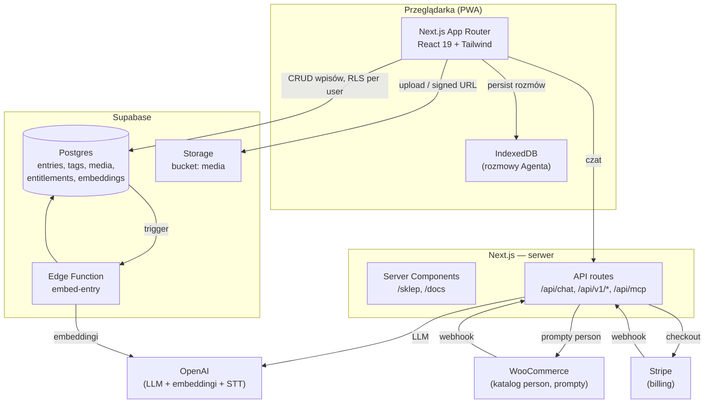
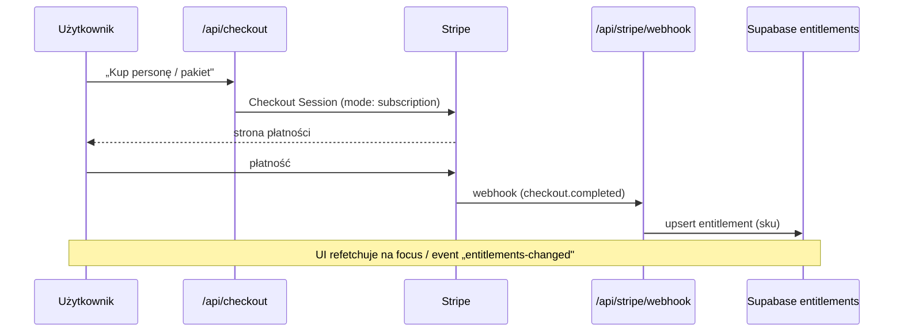

# Architektura — Dziennik

Osobista aplikacja-dziennik (PWA) dla jednego użytkownika, z wbudowanym asystentem AI, semantycznym wyszukiwaniem, publicznym API oraz serwerem MCP. Interfejs po polsku, mobile-first, z desktopowym widokiem typu „macOS Notes".

Ten dokument opisuje architekturę techniczną całości. Nie zawiera żadnych sekretów — wymienia jedynie **nazwy** zmiennych środowiskowych.

> 🧪 **Jesteś na gałęzi `eksperyment`.** Ten plik opisuje architekturę **produkcyjną** (`main`). Zmiany eksperymentu (wielu użytkowników, Strapi jako źródło prawdy wpisów, izolacja embeddingów) są w osobnym dokumencie: **[architektura-eksperyment.md](architektura-eksperyment.md)**. Produkcja jest nietykalna — eksperymentu nie mergujemy do `main`.

---

## Spis treści

1. [Przegląd](#przegląd)
2. [Stack technologiczny](#stack-technologiczny)
3. [Diagram wysokopoziomowy](#diagram-wysokopoziomowy)
4. [Warstwa danych](#warstwa-danych)
5. [Agent AI](#agent-ai)
6. [Wyszukiwanie semantyczne (embeddings)](#wyszukiwanie-semantyczne-embeddings)
7. [Sklep — headless WooCommerce](#sklep--headless-woocommerce)
8. [Płatności i uprawnienia (Stripe + entitlements)](#płatności-i-uprawnienia)
9. [Media](#media)
10. [Publiczne API i serwer MCP](#publiczne-api-i-serwer-mcp)
11. [Uwierzytelnianie](#uwierzytelnianie)
12. [Warstwa UI i responsywność](#warstwa-ui-i-responsywność)
13. [Routing](#routing)
14. [Struktura katalogów](#struktura-katalogów)
15. [Zmienne środowiskowe](#zmienne-środowiskowe)
16. [Warstwy legacy](#warstwy-legacy)

---

## Przegląd

**Dziennik** to prywatny journal PWA. Rdzeń to tworzenie i przeglądanie wpisów (tekst + zdjęcia + nastrój + tagi), a wokół niego zbudowano:

- **Agenta AI** — rozmowny asystent z 7 personami (terapeuta, coach kariery, doradca biznesowy, filozof, kreatywny, produktywność…), świadomy kontekstu wpisów z danego dnia.
- **Wyszukiwanie hybrydowe** — pełnotekstowe + wektorowe (embeddingi) po treści wpisów.
- **Headless sklep** — persony Agenta sprzedawane jako produkty z WooCommerce; billing przez Stripe.
- **Publiczne API + serwer MCP** — dziennik jako źródło danych dla zewnętrznych integracji i asystentów.

Aplikacja jest **jednoużytkownikowa w intencji**, ale dane są izolowane per użytkownik przez Row Level Security w Supabase.

---

## Stack technologiczny

| Warstwa | Technologia |
|---|---|
| Framework | **Next.js 16** (App Router), **React 19**, **TypeScript 5** |
| Styl | **Tailwind CSS 4**, prymitywy UI w stylu shadcn (Radix UI) |
| Edytor | **Tiptap 3** (StarterKit + placeholder) |
| Baza / auth / storage | **Supabase** (Postgres + RLS + Storage + Edge Functions) |
| AI SDK | **Vercel AI SDK** (`ai`) + `@ai-sdk/openai` + `@ai-sdk/react` |
| Płatności | **Stripe** (subskrypcja roczna) |
| Katalog sklepu | **WooCommerce** (headless, REST API) |
| MCP | `@modelcontextprotocol/sdk` + `mcp-handler` |
| Walidacja | **Zod 4** |
| Ikony / toasty | `lucide-react`, `sonner` |

> W `package.json` obecne są też `drizzle-orm`, `@libsql/client` (Turso) i `@vercel/blob` — to pozostałości starszej warstwy serwerowej, nieaktywne w bieżącym UI (patrz [Warstwy legacy](#warstwy-legacy)).

---

## Diagram wysokopoziomowy



---

## Warstwa danych

**Aktywną warstwą danych jest Supabase.** Cały CRUD interfejsu przechodzi przez [`src/lib/db-supabase.ts`](src/lib/db-supabase.ts) — `createEntry` / `updateEntry` / `deleteEntry` / `getEntry` / `listEntries` oraz zarządzanie tagami.

- **Klient przeglądarkowy**: [`src/lib/supabase/client.ts`](src/lib/supabase/client.ts) (`@supabase/ssr`), konfigurowany zmiennymi `NEXT_PUBLIC_SUPABASE_URL` i `NEXT_PUBLIC_SUPABASE_PUBLISHABLE_KEY`.
- **Izolacja danych**: każde zapytanie jest RLS-owane per `user_id` zalogowanego użytkownika. Zapisy do tabel wrażliwych (np. `entitlements`) tylko przez `service_role`.
- **Tabele**: `entries`, `tags`, `entry_tags`, `media`, `entry_embeddings`, `entitlements`.
- **Reaktywność UI**: mutacje wysyłają `window` `CustomEvent("entries-changed", { detail: { id, kind } })`, na który nasłuchują pozostałe panele (plus refetch na `window` `focus`). Ta sama konwencja obowiązuje dla rozmów (`conversations-changed`) i uprawnień (`entitlements-changed`).

### Migracje

Katalog [`supabase/migrations/`](supabase/migrations/):

| Migracja | Zawartość |
|---|---|
| `0001_entry_embeddings` | tabela wektorów `entry_embeddings` |
| `0002_search_entries_hybrid` | RPC hybrydowego wyszukiwania (FTS + wektory) |
| `0003_rls_hardening` | zaostrzenie polityk RLS |
| `0004_embed_webhook_secret` | sekret webhooka embeddingów |
| `0005_entitlements` | tabela uprawnień do person |

---

## Agent AI

Wbudowany asystent rozmowny oparty na **Vercel AI SDK**.

**Kluczowa zasada abstrakcji:** cała komunikacja z LLM przechodzi przez interfejs `ChatProvider` w [`src/lib/agent/provider.ts`](src/lib/agent/provider.ts). Komponenty UI i route handlery **nigdy** nie importują SDK dostawcy bezpośrednio. Zmiana dostawcy (OpenAI → Anthropic / Gemini) = nowy plik w [`src/lib/agent/providers/`](src/lib/agent/providers/) + jedna linia w `getChatProvider()`.

### Persony

- 7 person w [`src/lib/agent/personas/`](src/lib/agent/personas/): `advisor`, `career-coach`, `creative`, `philosopher`, `productivity`, `therapist` (+ warianty).
- Każda ma `defaultModel` (lekki, `gpt-4o-mini`) i `deepModel` (`gpt-4o`). Toggle „deep mode" per persona zapamiętywany w `localStorage`.
- **Prompty edytowalne z panelu WooCommerce** — patrz [Sklep](#sklep--headless-woocommerce).

### Kontekst dnia

Klient buduje payload przez [`src/lib/agent/entries-context.ts`](src/lib/agent/entries-context.ts):
- `dayEntries` — pełna treść wpisów z danego dnia,
- `entriesIndex` — lekki indeks reszty (id + snippet + tagi) trafiający do system promptu.

Model wywołuje narzędzie `fetchEntry(id)` (wykonywane po stronie klienta przez `onToolCall`), gdy potrzebuje pełnej treści konkretnego wpisu — dzięki temu nie ładujemy całej historii do promptu.

### Persystencja rozmów

Rozmowy żyją w **IndexedDB** (object store `conversations` w bazie `dziennik`), obsługiwane przez [`src/lib/conversations-client.ts`](src/lib/conversations-client.ts). Auto-tytuł rozmowy generuje osobny, lekki endpoint [`/api/chat/title`](src/app/api/chat/title/route.ts) po drugiej odpowiedzi asystenta.

### UI

`AgentSheet` — bottom-sheet (mobile fullscreen / desktop wyśrodkowany), sterowany globalnym stanem `useAgentSheet()`. Wiadomości renderuje własny minimalistyczny renderer Markdown (bez `react-markdown` — świadoma decyzja, by nie dokładać ~30 KB dla jednego use-case'a).

---

## Wyszukiwanie semantyczne (embeddings)

- **Generowanie**: Edge Function [`supabase/functions/embed-entry`](supabase/functions/embed-entry/) liczy embeddingi treści wpisów (OpenAI) i zapisuje do `entry_embeddings`. Wyzwalana przez webhook z zabezpieczeniem sekretem.
- **Wyszukiwanie hybrydowe**: RPC łączy full-text search Postgresa z podobieństwem wektorowym. Logika klienta: [`src/lib/api/embeddings.ts`](src/lib/api/embeddings.ts) i [`src/lib/api/hybrid-search.ts`](src/lib/api/hybrid-search.ts).
- **Backfill**: skrypty `scripts/embed-entries.mjs` i `scripts/setup-embeddings.mjs`.

---

## Sklep — headless WooCommerce

Sklep to **headless WooCommerce**: backend (WordPress + WooCommerce) na osobnym hostingu, frontend `/sklep` w tej aplikacji.

- **Klient**: [`src/lib/woocommerce.ts`](src/lib/woocommerce.ts) — **wyłącznie server-side** (Consumer Key/Secret nigdy nie trafiają do przeglądarki). Strona [`/sklep`](src/app/sklep/page.tsx) to Server Component (`revalidate = 60`).
- **Konsultanci = produkty.** Każda persona Agenta ma odpowiadający produkt WC (wirtualny) z polami własnymi: `persona_key`, `persona_prompt`, `persona_model`, `persona_deep_model`, `persona_temperature`, `persona_icon`. Doradca biznesowy (`advisor`) jest darmowy, reszta płatna.
- **Prompty z panelu WC.** Prompt persony edytuje się w WooCommerce (pole `persona_prompt`), a serwer czyta go w runtime przez `getPersonaOverrides()` → `resolvePersona()` ([`src/lib/agent/persona-source.ts`](src/lib/agent/persona-source.ts), server-only). Wpięte w oba route'y czatu: [`/api/chat`](src/app/api/chat/route.ts) i [`/api/v1/chat`](src/app/api/v1/chat/route.ts). Persona z kodu jest fallbackiem, gdy WC jest niedostępne. Odczyt cache'owany 60 s.
- **Seed/aktualizacja**: [`scripts/seed-shop.ts`](scripts/seed-shop.ts) — idempotentny po `persona_key`.

WooCommerce pełni rolę **katalogu i panelu administracyjnego promptów** — nie jest warstwą billingową.

---

## Płatności i uprawnienia

**Płatność = Stripe** (subskrypcja roczna). **Źródło prawdy o uprawnieniach = Supabase** (tabela `entitlements`, RLS: użytkownik czyta swoje, zapis tylko `service_role`).



- **Model uprawnień**: `sku` = `persona_key` (pojedyncza persona) albo `all` (pakiet = wszystkie obecne i przyszłe). Logika w [`src/lib/agent/entitlements.ts`](src/lib/agent/entitlements.ts) (`computeUnlocked`, `FREE_PERSONA_KEYS`, `BUNDLE_SKU`).
- **Gating dwuwarstwowy**:
  - *Klient* (obejściowalny, kosmetyczny): hook [`useEntitlements`](src/lib/agent/use-entitlements.ts) + wspólny [`PersonaMenuList`](src/components/agent/PersonaMenuList.tsx) — zablokowane persony wyszarzone, z kłódką i przyciskiem „Kup".
  - *Serwer* (prawdziwe egzekwowanie): [`/api/chat`](src/app/api/chat/route.ts) zwraca `402 persona_locked`, [`/api/v1/chat`](src/app/api/v1/chat/route.ts) sprawdza uprawnienia po `user_id`.
- **Skrypty Stripe**: `scripts/seed-stripe.ts` (Products/Prices), `scripts/prune-stripe-prices.ts` (utrzymanie jednej aktywnej ceny na produkt).

---

## Media

Zdjęcia trafiają do **Supabase Storage** (prywatny bucket `media`), nie do bazy jako `data:` URI.

- **Upload**: kompresja po stronie klienta ([`src/lib/clientImage.ts`](src/lib/clientImage.ts)) → `data:` URI w stanie formularza → przy zapisie blob wędruje do Storage pod kluczem `${userId}/${entryId}/${mediaId}.${ext}`, a metadane do tabeli `media`.
- **Odczyt**: `signMedia` zamienia klucz Storage na **signed URL** (TTL 1h).
- **Punkty wejścia**: FAB obok mikrofonu (mobile kalendarz), pill „Dodaj zdjęcie" (mobile wpis), menu „Dodaj element" + drag&drop (desktop).
- **Render**: miniatury nad treścią wpisu; własny lightbox z nawigacją klawiaturą.
- **Audio**: nagrywanie wyłączone. Mikrofon w edytorze służy **wyłącznie dyktowaniu (STT)** przez [`/api/transcribe`](src/app/api/transcribe/route.ts) i [`src/lib/useStt.ts`](src/lib/useStt.ts). Odtwarzanie starych nagrań pozostaje.

---

## Publiczne API i serwer MCP

Dziennik wystawia dane na zewnątrz na dwa sposoby.

### REST API `/api/v1/*`

Wersjonowane, publiczne API dla integracji. Zasoby:

| Endpoint | Opis |
|---|---|
| `GET/POST /api/v1/entries` | lista / tworzenie wpisów |
| `GET/PATCH/DELETE /api/v1/entries/[id]` | pojedynczy wpis |
| `.../[id]/mood`, `.../[id]/tags` | nastrój i tagi wpisu |
| `/api/v1/tags` | tagi |
| `/api/v1/conversations` | rozmowy Agenta |
| `/api/v1/assistants`, `.../current` | dostępne persony |
| `/api/v1/chat` | czat z Agentem (z serwerowym gatingiem person) |

Dokumentacja: strony [`/docs`](src/app/docs/), `openapi.json` oraz `llms.txt`.

### Serwer MCP `/api/mcp`

[`/api/mcp`](src/app/api/mcp/route.ts) udostępnia dziennik jako serwer **Model Context Protocol** (przez `mcp-handler`), dzięki czemu zewnętrzne asystenty AI mogą czytać i zapisywać wpisy jako narzędzia.

### Klucze API i OAuth

- Zarządzanie kluczami: [`/api/internal/api-keys`](src/app/api/internal/api-keys/) + UI w [`/ustawienia/api`](src/app/ustawienia/api/page.tsx).
- Przepływ OAuth: [`/oauth/authorize`](src/app/oauth/authorize/page.tsx) + [`/api/auth/callback`](src/app/api/auth/callback/route.ts).

---

## Uwierzytelnianie

- **Warstwa aplikacji**: Supabase Auth (logowanie e-mail/hasło), izolacja danych przez RLS. Strona [`/login`](src/app/login/page.tsx).
- **Legacy proxy-gate**: w [`src/proxy.ts`](src/proxy.ts) istnieje prosty gate hasłem (`AUTH_ENABLED`), obecnie **wyłączony**. Ponowne włączenie wymaga zmiennych `SESSION_SECRET` i `APP_PASSWORD` (patrz [`src/lib/session-server.ts`](src/lib/session-server.ts)).
- **Webhooki**: `/api/stripe/webhook` i `/api/woo/webhook` weryfikowane sekretami (`STRIPE_WEBHOOK_SECRET`, `WC_WEBHOOK_SECRET`).

---

## Warstwa UI i responsywność

Breakpoint rozdzielający tryb „mobile" i „desktop" to Tailwindowy `lg` (≥1024 px). Komponenty **nie rozgałęziają się w JS** — renderują oba warianty i przełączają je przez `lg:hidden` / `hidden lg:flex`.

- `AppShell` — wrapper treści strony (`wide` znosi ograniczenie szerokości dla split-view).
- `TopNav` — tylko desktop (`hidden lg:flex`, `h-14`).
- `BottomNav` — tylko mobile (`lg:hidden`).
- `HistorySplit` — dwupanelowy, przeciągalny layout historii; szerokość listy zapamiętywana w `localStorage`.

### Wspólny wzorzec edycji inline

`EntryEditor` to jeden edytowalny widok używany zarówno przez desktopowy panel podglądu, jak i mobilną stronę wpisu. Renderuje nagłówek (data + kasowanie + Zapisz) plus `EntryForm` w trybie `bare`. `EntryForm` działa w dwóch kształtach: `mode="create"` (pełny layout na `/`) oraz `mode="edit" bare` (edycja inline, `forwardRef` z `save()`).

### Design system

Wszystkie główne przyciski CTA przechodzą przez komponent `Button` (radius, rozmiary, warianty). Konwencje: chipy/pills `rounded-full h-8/h-9`, przyciski ikonowe `rounded-full` kwadrat, karty `rounded-xl/2xl`.

---

## Routing

| Ścieżka | Rola |
|---|---|
| `/` | nowy wpis (`EntryForm mode="create"`) |
| `/wpis/[id]` | edytor pojedynczego wpisu (główny na mobile) |
| `/historia` | lista z filtrami (`q`, `tag`, `from`, `to`, `mood`) i selekcją; desktop → `HistorySplit` |
| `/galeria` | widok zdjęć |
| `/sklep`, `/sklep/[slug]` | katalog konsultantów (WooCommerce) |
| `/historia-rozmow` | historia rozmów z Agentem |
| `/ustawienia/*` | konto, tagi, wygląd, API |
| `/docs/*` | dokumentacja API i MCP |
| `/login`, `/oauth/authorize` | auth |

Po utworzeniu wpisu przekierowanie zależy od viewportu: desktop → `/historia?id=<newId>`, mobile → `/wpis/<newId>`.

---

## Struktura katalogów

```
src/
├── app/                      # Next.js App Router
│   ├── api/
│   │   ├── chat/             # czat Agenta + auto-tytuł
│   │   ├── v1/               # publiczne REST API (entries, tags, chat, ...)
│   │   ├── mcp/              # serwer Model Context Protocol
│   │   ├── checkout/         # Stripe Checkout
│   │   ├── stripe/webhook/   # webhook billingu
│   │   ├── woo/webhook/      # webhook WooCommerce (sync promptów/cen)
│   │   ├── transcribe/       # STT
│   │   ├── personas/         # lista person
│   │   └── internal/api-keys # zarządzanie kluczami API
│   ├── historia/  wpis/  galeria/  sklep/  ustawienia/  docs/  ...
│   └── page.tsx              # nowy wpis
├── components/
│   ├── agent/  entry/  history/  media/  mobile/  settings/  shop/  ui/
├── lib/
│   ├── db-supabase.ts        # AKTYWNA warstwa danych (CRUD)
│   ├── supabase/             # klienty @supabase/ssr
│   ├── agent/                # provider, persony, entitlements, prompt-builder
│   ├── api/                  # embeddings, hybrid-search
│   ├── woocommerce.ts        # klient WC (server-only)
│   ├── stripe.ts  checkout.ts
│   ├── clientImage.ts  clientMedia.ts   # media po stronie klienta
│   └── ...                   # dates, moods, theme, useStt, ...
└── db/                       # (legacy) schema Drizzle
supabase/
├── migrations/               # 0001–0005
└── functions/embed-entry/    # Edge Function embeddingów
scripts/                      # seed-shop, seed-stripe, embed-entries, ...
```

---

## Zmienne środowiskowe

Sekrety trzymane **wyłącznie lokalnie w `.env.local`** (gitignore: `.env*`) i w konfiguracji hostingu. Poniżej tylko **nazwy** — bez wartości.

| Zmienna | Do czego |
|---|---|
| `NEXT_PUBLIC_SUPABASE_URL` | publiczny URL Supabase |
| `NEXT_PUBLIC_SUPABASE_PUBLISHABLE_KEY` | publiczny klucz Supabase (klient) |
| `OPENAI_API_KEY` | LLM, embeddingi, STT (server-only) |
| `WOOCOMMERCE_URL` | endpoint sklepu WC (server-only) |
| `WOOCOMMERCE_CONSUMER_KEY` / `_SECRET` | dostęp do REST API WooCommerce (server-only) |
| `WC_WEBHOOK_SECRET` | weryfikacja webhooka WC |
| `STRIPE_SECRET_KEY` | billing (server-only) |
| `STRIPE_WEBHOOK_SECRET` | weryfikacja webhooka Stripe |
| `SESSION_SECRET` / `APP_PASSWORD` | opcjonalny proxy-gate hasłem (obecnie wyłączony) |

> Uwaga bezpieczeństwa: klucze WooCommerce i Stripe oraz `OPENAI_API_KEY` **nigdy** nie mogą mieć prefiksu `NEXT_PUBLIC_` — są używane wyłącznie w kodzie serwerowym.

---

## Warstwy legacy

Kilka warstw pozostaje w repozytorium, ale **nie jest używanych** przez bieżące UI. Nie należy budować na nich nowych funkcji:

- **IndexedDB dla wpisów** ([`src/lib/db-client.ts`](src/lib/db-client.ts)) — już nie obsługuje wpisów. Baza `dziennik` IDB służy teraz **tylko** jako magazyn store `conversations` (rozmowy Agenta). Wspólny opener: [`src/lib/idb.ts`](src/lib/idb.ts).
- **Backend serwerowy Drizzle** — [`src/lib/entries.ts`](src/lib/entries.ts), [`src/db/`](src/db/), stare route'y oraz [`src/lib/storage.ts`](src/lib/storage.ts) (Vercel Blob / Turso). Pozostałość po poprzednim backendzie; niewykorzystywana przez interfejs.

Aktywna ścieżka danych to zawsze: **UI → [`src/lib/db-supabase.ts`](src/lib/db-supabase.ts) → Supabase (Postgres + Storage, RLS per user)**.
